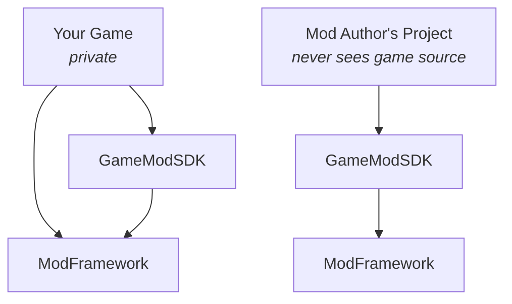

# ModFramework

A reusable modding framework for Unreal Engine 5, in two plugins:

- **`ModFramework`** — game-agnostic. Discovery, manifests, versioning, dependency resolution, mod
  lifecycle, content mounting, API and extension registries, permissions, isolated save data,
  multiplayer manifest validation, packaging and developer tooling. It contains **no** gameplay
  concepts — no `UWeaponMod`, no `UQuestMod`.
- **`GameModSDK`** — game-specific. The public modding surface a game developer publishes to mod
  authors: game APIs, extension points, base classes, events and data assets.

The goal: let a UE5 game expose a **controlled, versioned modding API without shipping game source**,
and let mod authors build against it without ever opening the game project.

> **Status: in development.** The core runtime is being implemented; nothing is release-ready yet.
> See [Roadmap](#roadmap).

---

## The boundary



A mod author installs the SDK bundle and nothing else. That is the whole point, and it is enforced
by a build check rather than by discipline: the example mod is compiled inside a project containing
**only** the generated bundle. If it builds there, the SDK is genuinely self-sufficient.

`GameModSDK` may never reference the game's own module. If an API needs to reach game code, it goes
behind a `UModAPI` the game registers at runtime.

## Layout

```
ModFramework/                      repo root
├── ModFramework/                  the framework plugin
│   └── Source/
│       ├── ModFramework/          runtime
│       ├── ModFrameworkDeveloper/ packaging, validation, SDK generation
│       └── ModFrameworkEditor/    Mod Developer window, SDK generation UI
├── GameModSDK/                    the reference SDK plugin
├── Templates/ModFrameworkSample/  sample game (UE5 Third Person + Combat variant)
│   └── Mods/ExampleMod/           a mod, in a default discovery directory
├── docs/
└── Setup.ps1
```

## Getting started

```bash
git clone https://github.com/1aydan/ModFramework.git
cd ModFramework
./Setup.ps1
```

`Setup.ps1` links both plugins into the sample project. It uses directory junctions rather than the
project's `AdditionalPluginDirectories` setting on purpose — that setting is honoured only under
`WITH_EDITOR`, so it works in the editor and then silently breaks the packaged build, which is
exactly the case this framework exists to serve.

Then generate project files for `Templates/ModFrameworkSample/ModFrameworkSample.uproject` and open
it. Requires **UE 5.8**.

## Design commitments

Some of these are unusual enough to state up front.

**Loaded and Activated are separate states.** A mod can be mounted and loaded without being live.
Half the lifecycle bugs in modding systems come from conflating the two.

**Stable IDs, never display names.** `com.example.bettercombat` is the key for save data, dependency
references, load order and multiplayer matching. Renaming an id creates a different mod.

**Five independent versions** — UE, game, framework, SDK, and per-API. A game patches constantly and
almost never changes its modding surface; mods pin the **API**, so a hotfix doesn't invalidate the
ecosystem. See [Versioning.md](docs/Versioning.md).

**Deterministic load order.** Topological sort with `(priority desc, id asc)` tie-breaks — identical
on every machine, every run.

**Rejection happens before mounting.** An incompatible mod cannot have partially applied itself, and
the error names the actual problem rather than "failed to load".

**Conflicts are declared and resolved by policy**, not decided silently by load order. The default
is `Error`, because silently picking a winner trains developers to ignore conflicts.

**Removing a mod never corrupts a save.** Orphaned records are preserved byte-for-byte; only an
explicit purge deletes one.

**Mods are untrusted input.** Nothing `check()`s on mod data. Paths are containment-checked, package
sizes validated before allocation, and a joining client's manifest is treated as attacker-controlled.

**Blueprint mods are not a sandbox** — and this framework will not pretend otherwise. Permissions are
API access control, not process isolation. [Security.md](docs/Security.md) explains why that
distinction matters and what it means for your player-facing UI.

## Documentation

| | |
|---|---|
| [Architecture](docs/Architecture.md) | Layers, lifecycle, resolution, the seams and why they exist |
| [Versioning](docs/Versioning.md) | The five versions, semver rules, range syntax |
| [Manifest format](docs/ManifestFormat.md) | Every `mod.json` field, with diagnostics |
| [Permissions](docs/Permissions.md) | Requesting, granting, custom policies |
| [Security](docs/Security.md) | The trust model, and its honest limits |
| [Multiplayer](docs/Multiplayer.md) | Session manifests, server authority |
| [Conflicts](docs/Conflicts.md) | Claims, policies, resolution |
| [Public API marking](docs/PublicAPIMarking.md) | Marking what goes into your SDK |
| [Packaging](docs/Packaging.md) | The `.mod` format, cooking, distribution |
| [Console commands](docs/ConsoleCommands.md) | Runtime diagnostics |

## Roadmap

MVP — a third-party developer can install the SDK in a separate project, build a mod, package it,
drop it into the game, and have it discovered, loaded and activated.

- [x] Manifest format, semver and version ranges
- [ ] Mod discovery, validation, dependency resolution
- [ ] Lifecycle, content mounting, asset discovery
- [ ] API and extension registration
- [ ] Blueprint / Data Asset modding path
- [ ] SDK generation and mod packaging
- [ ] Console commands and editor tooling
- [ ] Automated tests
- [ ] Working example mod in the sample game

Deliberately **not** in the MVP: Lua scripting, native C++ mods, Steam Workshop integration. Each
needs the lifecycle, SDK boundary and mounting to be stable first, and native code in particular
needs ABI, signing and revocation answers that are distribution problems rather than framework ones.

## Licence

MIT — see [LICENSE](LICENSE).
